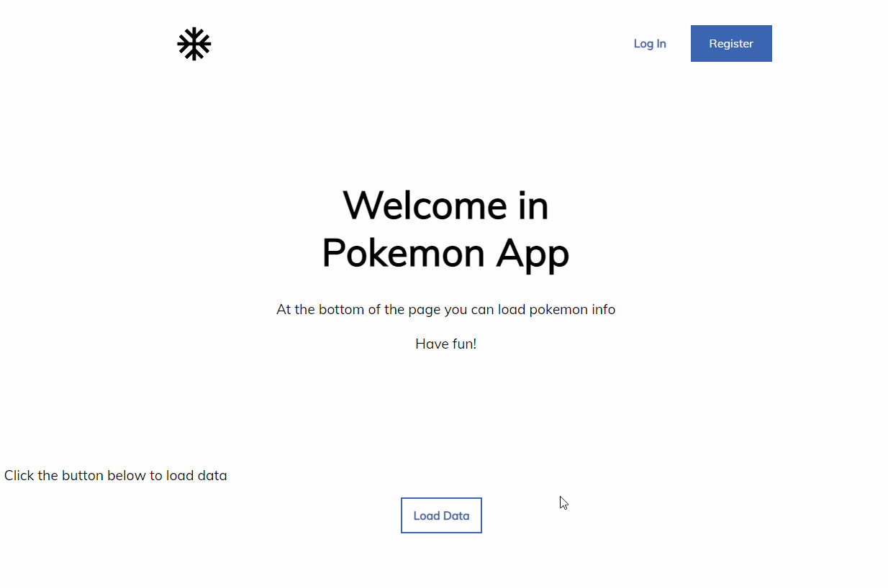

# Pokemon App

## Used technologies

- React.js
- Sass
- Axios

## Start application
Move to the root directory where the package.json exists and type:

```bash
npm install
```

That will install all configs and libraries.
Then, staying in root type:

```bash
npm start
```

That command will run app.

## Example of usage

<p align="center">

</p>
